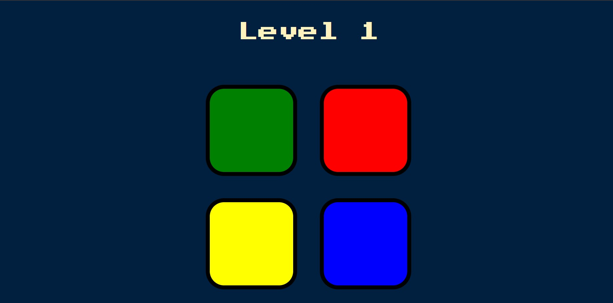

# 🎵 Simon Game

  
  
  

A fun **Simon Game clone** built with **HTML, CSS, JavaScript, and jQuery**.  
The goal is simple: **repeat the sequence of lights and sounds** as long as you can without making a mistake!  

👉 **Play it here:** [Simon Game Live Demo](https://reavanthkumar.github.io/simon-game/)  

---

## 🚀 Features

- **Classic Gameplay** – Remember and repeat the sequence  
- **Dynamic Difficulty** – Each level adds a new random color to the sequence  
- **Sound Effects** – Each button has its own unique sound  
- **Game Over Effect** – Visual + audio feedback when you lose  
- **Restart Anytime** – Press any key to restart after game over  

---

## 📂 Project Structure
├── index.html # Main game UI
├── styles.css # Styling for the game
├── script.js # Game logic
├── sounds/ # Sound files
│ ├── blue.mp3
│ ├── green.mp3
│ ├── red.mp3
│ ├── yellow.mp3
│ └── wrong.mp3
└── README.md # Project documentation
## ⚙️ How to Run Locally

1. Clone the repository:
   ```bash
   git clone https://github.com/<your-username>/simon-game.git
   cd simon-game
   ```
2. Open the index.html file in your browser

---
## 📸 Demo Screenshot

